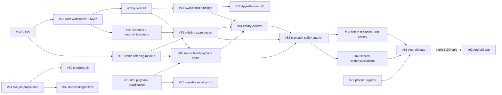

# Pod0 iOS-first, Rust/NMP-ready engineering roadmap

Status: executable backlog published on GitHub on 2026-07-18. This document records the evidence, ownership decisions, sequence, and gates behind issues [#55–#83](https://github.com/pablof7z/pod0/issues?q=is%3Aissue%20is%3Aopen%20sort%3Acreated-asc).

## 1. Current-state audit

### Architecture and composition

- `master` is a native Swift 6/Tuist iOS+iPadOS application with a widget. The repository contains 545 Swift files and about 84k Swift lines.
- Production code is concentrated in `Features` (194 files), `Services` (53), `Agent` (47), `State` (29), `Workflows` (21), `Podcast` (20), `Domain` (19), `Knowledge` (11), `Transcript` (10), and `Audio` (8).
- There is no `Cargo.toml`, Rust source, UniFFI/JNI bridge, Kotlin source, Android project, or Kotlin smoke harness.
- `Project.swift` uses Swift packages for secp256k1, SQLiteVec, and Kingfisher. CI is Swift/iOS-only and uses self-hosted runners.

### Durable state and business rules

- `AppStateStore` is `@MainActor @Observable`; `private(set) state: AppState` and `mutateState` are the central Swift mutation path.
- `Persistence` is SQLite-authoritative. Legacy JSON is one-shot migration input only.
- The SQLite database stores an `AppState` JSON metadata blob without episodes, per-episode JSON payload rows, a monotonic generation, workflow jobs, schema metadata, and artifact metadata. Transcript/download/vector artifacts also exist as files or a separate SQLite index.
- Keychain owns provider secrets; some settings synchronize through iCloud key-value storage; the widget reads an app-group snapshot.
- Major Swift product-policy owners include subscription/feed normalization, episode merge rules, playback queue/resume/completion/sleep behavior, download desired state, workflow planning/recovery, transcript normalization/chunking, retrieval/evidence ranking, notes/clips, and agent tool validation/dispatch.

### Rust, NMP, and cross-platform status

- The prior Swift NMP/comment migration was removed in `6acea193` after the product surface was narrowed. NMP is **removed**, not partially integrated.
- Residual app-local Nostr code is limited mainly to key/event helpers and agent-generated media/Blossom signing. It is not a generic NMP-backed application core.
- Existing Swift protocols around agent tools, playback hosts, library access, RAG, provider clients, and workflow executors are useful characterization seams, but they are not a cross-platform facade.
- Future NMP use must be pinned behind a Pod0-owned Rust adapter. Podcast, episode, workflow, agent, and artifact nouns stay out of generic NMP crates.

### Tests and testability

- `AppTests/Sources` contains 75 Swift test files. The current master tree previously passed 585 simulator tests plus the workflow process-reconstruction harness after PRs [#36](https://github.com/pablof7z/pod0/pull/36) and [#54](https://github.com/pablof7z/pod0/pull/54).
- Strong characterization exists for feed/RSS/OPML, subscriptions, playback queue/resume, transcripts/parsers/ingest, RAG, downloads, agent tools, and workflow leases/fencing/recovery.
- `AppStateMutationBoundaryTests` is an existing useful guardrail, but it catches only part of the possible UI-to-storage coupling.
- Missing coverage: Rust unit/property tests, FFI contract tests, deterministic shared command/event fixtures, binding drift, Android-target builds, Kotlin smoke tests, and Swift-state-to-Rust migration tests.

### Major risks

1. Existing user data is encoded in Swift Codable payloads; identity or decoder drift can duplicate or lose library/resume state.
2. `PlaybackState` combines legitimate native execution with durable cross-platform policy; a coarse boundary is required to avoid FFI chatter and stale callback commits.
3. The mature Swift workflow architecture prevents duplicate paid work through leases, fencing, staging, and recovery. A later Rust migration must preserve those semantics rather than replace them generically.
4. Transcript evidence is the trust boundary of the product. Timestamp/provenance drift is more damaging than a missing answer.
5. README/spec documents describe deleted NMP surfaces, older persistence, and obsolete product assumptions; planning against them would be unsafe.
6. No coherent product-proof analytics exists, so Android investment would currently be a subjective decision.

### Unknowns that need a decision or spike

- Exact Rust persistence implementation and database-file layout: resolved by [#63](https://github.com/pablof7z/pod0/issues/63), implemented/tested by [#75](https://github.com/pablof7z/pod0/issues/75).
- NMP revision and upgrade policy: [#63](https://github.com/pablof7z/pod0/issues/63) and [#73](https://github.com/pablof7z/pod0/issues/73).
- Cross-platform vector-index backend and rebuild strategy: deferred until [#69](https://github.com/pablof7z/pod0/issues/69).
- Platform key custody versus shared signing intent for Nostr: deferred to epic [#60](https://github.com/pablof7z/pod0/issues/60).
- Product threshold/sample definitions for the Android gate: predeclared by [#72](https://github.com/pablof7z/pod0/issues/72), evaluated by epic [#61](https://github.com/pablof7z/pod0/issues/61).

## 2. Ownership map

| Subsystem | Classification | Reason and target boundary | Priority |
|---|---|---|---|
| SwiftUI views, navigation, animations, transient presentation | Native by design | Native rendering and interaction; reads coarse projections and sends typed intents | Keep native |
| AudioEngine, audio session/routes, Now Playing, remote commands, CarPlay | Native by design | AVFoundation/OS capability executor; reports typed observations | Keep native |
| BGTask, background URLSession, notifications | Native by design | OS entry points and effects; shared core decides desired state/retry | Keep native |
| Keychain, biometrics, provider credential prompts | Native by design | Platform security; core receives capability/result, never raw UI types | Keep native |
| Podcast/Episode/Subscription identity and feed normalization | Shared Rust now | Stable cross-platform durable models and policy | First slice |
| Feed HTTP fetch/cache validators | Native by design | URLSession/Media platform execution; bytes and validators cross typed boundary | First slice |
| Queue, resume, completion, rate preference, sleep semantics | Shared Rust now | Durable behavior Android must share | First slice |
| AppStateStore/Persistence listening fields | Temporary Swift | Current authority until versioned import/cutover in #79/#81/#82; deleted by #83 | Highest |
| Workflow planner/jobs/leases/fencing/artifacts | Temporary Swift | Strong current implementation; migrate workflow-kind slices through #60 | High, after facade proof |
| Download admission/retry/desired state | Shared Rust now | Durable cross-platform policy; native URLSession executes | M4 |
| Transcript normalized model, chapters, spans, provenance | Shared Rust now | Durable knowledge identity and trust boundary | M3 |
| Provider HTTP clients and Apple Speech | Native by design | Platform/network capability adapters returning typed observations | M3 |
| Chunking, retrieval, evidence ranking, citations | Temporary Swift | Product proof behind protocols in #71; mandatory Rust migration/deletion #69 | High |
| Highlights, notes, clips and immutable source snapshots | Shared Rust now | Durable cross-platform user artifacts and provenance | M3 |
| VectorIndex/SQLiteVec implementation | Undecided pending investigation | Rust-owned policy/storage required; backend choice waits for M3 evidence | M3 |
| Agent chat UI/streaming presentation | Native by design | Native conversation presentation and transient stream state | Keep native |
| Agent tools, permissions, validation, commits, job recovery | Temporary Swift | Migrate to shared core in #60; native adapters execute capabilities | M4 |
| Pod0 Nostr event/publication/remote-agent semantics | Shared Rust now | Pod0-owned layer over generic NMP | M4 |
| Nostr key custody and biometric authorization | Native by design | Platform security capability; Rust issues typed signing intents | M4 |
| Android UI/Media3/WorkManager/Keystore | Native by design, gated | Starts only after M5 go decision | M6 |

No Swift business logic is considered debt merely because it is Swift. Inventory issue [#64](https://github.com/pablof7z/pod0/issues/64) expands this map to every production owner and requires a migration/deletion link for each temporary entry.

## 3. Milestone plan

### M0 — Architecture baseline and guardrails

- **Objective/outcome:** make ownership explicit and enforceable without blocking product work.
- **Epics:** [#55](https://github.com/pablof7z/pod0/issues/55).
- **Entry:** current master audit.
- **Exit:** ADRs accepted; complete ownership inventory; UI/storage and file-length ratchets active; PR checklist active; current docs authoritative.
- **Dependencies:** none. Runs in parallel.
- **Risks:** prose-only rules or noisy CI.
- **Gate/sequence:** active now; small and non-blocking.

### M1 — iOS product-proof foundation

- **Objective/outcome:** a reliable listen-to-recall journey with truthful job state and decision-quality evidence.
- **Epics:** [#56](https://github.com/pablof7z/pod0/issues/56).
- **Entry:** current iOS app and workflow hardening on master.
- **Exit:** subscribe/play/resume interruption matrix passes; recall produces exact playable evidence; workflow status/actions/errors are truthful; privacy-safe signals cover the journey.
- **Dependencies:** none for implementation; M0 checklist applies as it lands.
- **Risks:** reliability defects masquerade as product failure; temporary RAG logic becomes permanent.
- **Gate/sequence:** active now, in parallel with M0/M2 bootstrap.

### M2 — Shared kernel bootstrap and first listening slice

- **Objective/outcome:** one typed Rust/UniFFI seam and one complete Rust-authoritative listening flow.
- **Epics:** facade [#57](https://github.com/pablof7z/pod0/issues/57), vertical slice [#58](https://github.com/pablof7z/pod0/issues/58).
- **Entry:** ownership/persistence/FFI ADRs; existing playback/feed fixtures.
- **Exit:** Swift/Kotlin bindings and Apple/Android builds pass; current data imports safely; Rust alone owns subscription/library/queue/resume/completion/sleep policy; native AVFoundation executes; obsolete Swift ownership is deleted.
- **Dependencies:** #63; playback qualification #70 feeds host acceptance.
- **Risks:** data loss/identity drift; FFI cadence; dual writers.
- **Gate/sequence:** bootstrap starts now; cutover is next after contracts/import/hosts.

### M3 — Transcript and knowledge vertical slices

- **Objective/outcome:** exact transcript evidence and durable user knowledge have shared identities/provenance.
- **Epics:** [#59](https://github.com/pablof7z/pod0/issues/59).
- **Entry:** M2 facade and listening cutover; validated recall UX.
- **Exit:** transcript/chapter/span/search/highlight/note/clip slices have Rust authority, migration/recovery tests, Kotlin compatibility, and deleted Swift owners.
- **Dependencies:** #82 blocks first evidence migration #69.
- **Risks:** timestamp/provenance drift and expensive re-indexing.
- **Gate/sequence:** next; decompose further only after M2 evidence.

### M4 — Durable workflows, agent artifacts, and Nostr coordination

- **Objective/outcome:** shared decisions recover safely while native platforms execute background/security/network capabilities.
- **Epics:** [#60](https://github.com/pablof7z/pod0/issues/60).
- **Entry:** proven persistence/FFI/recovery patterns from M2–M3.
- **Exit:** migrated workflow kinds have one Rust writer, fault-injection proof, typed permissions/commits, and Pod0 Nostr semantics over generic NMP; replaced Swift owners are deleted.
- **Dependencies:** M2–M3 and signer/permission ADRs.
- **Risks:** duplicate paid operations, unsafe remote actions, lost staged artifacts.
- **Gate/sequence:** later, vertical slice by workflow kind.

### M5 — iOS validation and Android investment gate

- **Objective/outcome:** explicit go/hold/stop decision based on value, reliability, safety, performance, and shared-core readiness.
- **Epics:** [#61](https://github.com/pablof7z/pod0/issues/61).
- **Entry:** predeclared metrics; representative M2–M4 shared slices; Kotlin/Android compile proof.
- **Exit:** reviewed gate report covers repeat use, listening reliability, recall usefulness, highlight behavior, agent engagement, crash/data loss, latency, shared durable-logic coverage, and Apple assumptions; ADR records go/hold/stop.
- **Dependencies:** #72 and evidence from M1–M4.
- **Risks:** vanity metrics or an underpowered cohort.
- **Gate/sequence:** gated; compilation alone cannot pass it.

### M6 — Android native application

- **Objective/outcome:** native Compose/Media3/WorkManager/Keystore shell consumes proven shared behavior.
- **Epics:** [#62](https://github.com/pablof7z/pod0/issues/62).
- **Entry:** explicit M5 go ADR and stable Kotlin facade.
- **Exit:** prioritized subscribe/listen/resume/recall flows pass Android process-death and cross-platform behavioral parity tests without Kotlin business-policy duplication.
- **Dependencies:** M5 go.
- **Risks:** platform mismatch or accidental second implementation.
- **Gate/sequence:** later and explicitly gated.

## 4. Epic inventory

| Epic | Outcome | Child work | Milestone / priority |
|---|---|---|---|
| #55 Ownership contract | Every owner classified and guarded | #63–#68 | M0 / P0 |
| #56 iOS listen-to-recall proof | Reliable journey, truthful jobs, grounded recall, signals | #48, #50–#53, #70–#72 | M1 / P0 |
| #57 Rust facade | One typed Swift/Kotlin UniFFI API | #73–#77 | M2 / P0 |
| #58 First listening slice | Rust owns subscribe/library/playback policy | #78–#83 | M2 / P0 |
| #59 Transcript knowledge | Evidence/provenance and artifacts share one owner | representative #69; further slices after M2 | M3 / P1 |
| #60 Durable agent/workflows/Nostr | Recoverable policy with native capabilities | representative breakdown in epic | M4 / P1 |
| #61 Android investment gate | Evidence-based go/hold/stop | metric and audit breakdown in epic | M5 / P0 gate |
| #62 Android native shell | Compose app consumes proven core | representative breakdown in epic | M6 / gated |

Each epic body contains scope, non-goals, source-of-truth transition, risks, completion demo, tests, rollback, and deletion targets.

## 5. Complete near-term issue specifications

The full issue-ready specifications live in GitHub and include context, exact scope/non-goals, one ownership classification, before/after source of truth, proposed interface, observable acceptance criteria, dependencies, migration/rollback, risk, and XS/S/M/L estimate.

- **M0:** [#63 ADR set](https://github.com/pablof7z/pod0/issues/63), [#64 owner inventory](https://github.com/pablof7z/pod0/issues/64), [#65 UI/storage boundary](https://github.com/pablof7z/pod0/issues/65), [#66 PR checklist](https://github.com/pablof7z/pod0/issues/66), [#67 docs cleanup](https://github.com/pablof7z/pod0/issues/67), [#68 CI ratchets](https://github.com/pablof7z/pod0/issues/68).
- **M1:** [#48 off-main verification](https://github.com/pablof7z/pod0/issues/48), [#51 live job projections](https://github.com/pablof7z/pod0/issues/51), [#50 progress UI](https://github.com/pablof7z/pod0/issues/50), [#52 honest diagnostics](https://github.com/pablof7z/pod0/issues/52), [#53 actionable errors](https://github.com/pablof7z/pod0/issues/53), [#70 playback qualification](https://github.com/pablof7z/pod0/issues/70), [#71 playable recall](https://github.com/pablof7z/pod0/issues/71), [#72 product signals](https://github.com/pablof7z/pod0/issues/72).
- **M2 facade:** [#73 workspace/NMP](https://github.com/pablof7z/pod0/issues/73), [#74 typed FFI](https://github.com/pablof7z/pod0/issues/74), [#75 schemas/determinism](https://github.com/pablof7z/pod0/issues/75), [#76 bindings/drift](https://github.com/pablof7z/pod0/issues/76), [#77 Apple/Android CI](https://github.com/pablof7z/pod0/issues/77).
- **M2 slice:** [#78 stable models/fixtures](https://github.com/pablof7z/pod0/issues/78), [#79 state import](https://github.com/pablof7z/pod0/issues/79), [#80 native hosts](https://github.com/pablof7z/pod0/issues/80), [#81 library cutover](https://github.com/pablof7z/pod0/issues/81), [#82 playback-policy cutover](https://github.com/pablof7z/pod0/issues/82), [#83 delete Swift owners](https://github.com/pablof7z/pod0/issues/83).
- **Next representative migration:** [#69 shared evidence ranking/citations](https://github.com/pablof7z/pod0/issues/69). It is the mandatory deletion target for temporary iOS proof issue #71.

## 6. Dependency and critical-path view

Plain summary:

- M0 inventory/docs/guardrails, M1 workflow UX/analytics, Rust bootstrap, schema work, and listening-model fixtures can run in parallel.
- The first Rust-backed slice is blocked by one typed facade, stable identities, safe import, and qualified native hosts.
- The critical cutover path is `#63 → #73/#74/#75/#78 → #76/#79/#80 → #81 → #82 → #83`.
- iOS validation is blocked by reliable playback, truthful jobs, grounded recall, product signals, and representative shared-core cutovers.
- Android is blocked by the explicit M5 go decision, not merely Kotlin binding compilation.
- Highest-risk migration points are existing-state import, stopping the Swift writer, stale playback observations, transcript provenance, and later workflow external-operation recovery.

## 7. Now / next / later

### Now

- #63–#66: accept ownership/FFI/persistence/gate rules and make them part of review.
- #48, #51, #53, #70, #72: remove product-proof reliability/observability/measurement blind spots.
- #73, #75, #78: bootstrap the core, schema discipline, and stable listening fixtures.
- Continue visible iOS work under the checklist; do not wait for the complete core.

### Next

- #50, #52, #71: finish truthful workflow UX and one grounded playable recall interaction.
- #74, #76, #77: make the one facade consumable and portable.
- #79/#80 in parallel, then #81 → #82 → #83.
- Begin #69 only after the listening slice proves the migration pattern.

### Later

- M3 transcript/knowledge slices, then M4 download/workflow/agent/Nostr slices.
- M5 go/hold/stop review.
- M6 Android only after an explicit go; native UI/platform integration, shared durable policy.

## 8. Open decisions

### Rust persistence engine and file layout

- **Options:** Rust-owned SQLite in a new app-core database; Rust opens the current mixed database; native storage capability under Rust policy.
- **Recommendation:** a Rust-owned SQLite store with explicit app-core schemas, staged import from the current mixed database, and one writer after cutover.
- **Evidence:** current metadata/episode/workflow co-location and Swift Codable payloads make in-place mixed ownership risky.
- **Delay consequence:** #75 and #79 cannot finalize.
- **ADR:** #63; implementation #75.

### NMP dependency/version strategy

- **Options:** track NMP main; pin a released/reviewed revision; vendor/fork.
- **Recommendation:** pin a reviewed revision behind a Pod0 adapter, test conformance, and upgrade deliberately. Do not restore the deleted Swift NMP layer.
- **Evidence:** recent NMP surface was removed; no current dependency exists; generic NMP must stay free of Pod0 nouns.
- **Delay consequence:** workspace and future Nostr work can choose incompatible seams.
- **ADR/implementation:** #63/#73.

### Vector-index backend

- **Options:** Rust sqlite-vec; Rust HNSW/another embedded index; native index capability.
- **Recommendation:** time-box a Rust sqlite-vec portability/latency/rebuild proof first because the app already uses SQLiteVec and needs deterministic artifact versioning; change only if Android/build/performance evidence fails.
- **Evidence:** current Swift VectorIndex is mature, but the backend has not been tested through Rust on both targets.
- **Delay consequence:** none for M0–M2; blocks M3 decomposition.
- **Spike:** first step of #69 or a child spike created when M3 enters active work.

### Nostr key custody and authorization

- **Options:** keys in Rust storage; platform Keychain/Keystore capability; external signer/NIP-46.
- **Recommendation:** platform secure custody and biometric prompts, with Rust producing typed signing intents and enforcing Pod0 permissions; support external signer as a capability.
- **Evidence:** security APIs are platform-native, while authorization/event semantics must be shared.
- **Delay consequence:** none for M0–M3; blocks M4 remote-agent/Nostr cutover.
- **ADR/spike:** child of #60 when M4 enters active work.

### Android gate thresholds

- **Options:** fixed launch checklist; metric/confidence gate; discretionary review.
- **Recommendation:** predeclare metric definitions, minimum evidence, reliability/data-loss budgets, architecture coverage, and a go/hold/stop rule before observing results.
- **Evidence:** no current coherent product analytics exists.
- **Delay consequence:** evidence becomes post-hoc and Android may start on optimism.
- **Decision work:** #72 then #61.

## 9. Backlog quality audit

- [x] Every epic has a measurable outcome and completion demonstration.
- [x] Every near-term issue has acceptance criteria, exact classification, before/after owner, risk, estimate, and dependency links.
- [x] No issue proposes a broad rewrite; XL work is split into vertical slices.
- [x] Temporary Swift work links migration/deletion: #71 → #69; workflow temporary owners → #60; listening owners → #83.
- [x] Android product work is gated in M6; Kotlin/Android compile validation arrives in M2.
- [x] Native UI, AVFoundation, OS background execution, notifications, and platform security remain native.
- [x] Each migrated durable domain has one intended Rust owner and a no-dual-write cutover.
- [x] First-slice cleanup is #83, immediately after #82 rather than a later catch-all.
- [x] Visible iOS progress in M1 runs in parallel with M0/M2 architecture work.
- [x] Existing workflow issues #48 and #50–#53 were preserved and upgraded rather than duplicated.
- [x] Obsolete NMP milestones were closed; historical closed issues remain intact.

## GitHub organization

- Active milestones: [M0](https://github.com/pablof7z/pod0/milestone/7), [M1](https://github.com/pablof7z/pod0/milestone/8), [M2](https://github.com/pablof7z/pod0/milestone/9), [M3](https://github.com/pablof7z/pod0/milestone/10), [M4](https://github.com/pablof7z/pod0/milestone/11), [M5](https://github.com/pablof7z/pod0/milestone/12), [M6](https://github.com/pablof7z/pod0/milestone/13).
- Native GitHub parent/sub-issue and blocked-by relationships encode hierarchy and critical path.
- Labels cover type, area, phase, and risk; estimates remain in issue bodies to avoid label sprawl.
- A dedicated GitHub Project could not be created because the authenticated automation account lacks permission to create Projects under the repository owner. No work was placed into the unrelated “Chief of Staff — Decisions” project.
